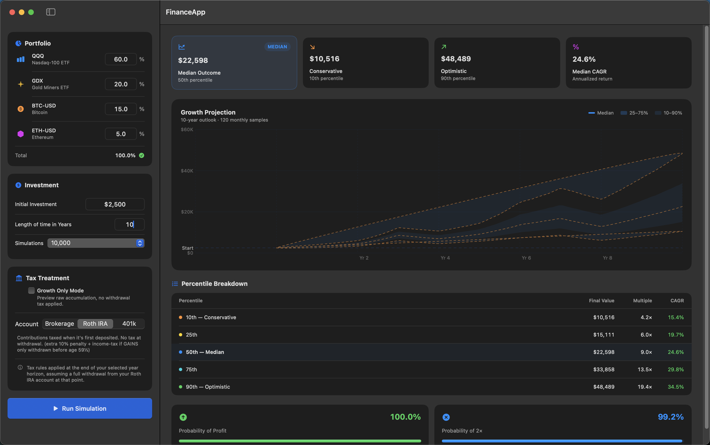

# FinanceApp

A macOS portfolio simulator that uses **Monte Carlo block bootstrap** to model realistic multi-year investment growth preserving real-world return clustering and volatility patterns from historical data.



---

## What It Does

You configure a portfolio of assets (tickers + weights), an initial investment, a time horizon, and a tax treatment. The backend runs thousands of simulations by resampling historical year-blocks with replacement, then the app displays the full outcome distribution as a growth projection cone and percentile breakdown table.

**Key outputs:**
- **Median Outcome** 50th percentile final value
- **Conservative** 10th percentile (bad luck scenario)
- **Optimistic** 90th percentile (good luck scenario)
- **Median CAGR** annualized return at the median

---

## Features

- **Block Bootstrap Monte Carlo** resamples historical year-blocks to capture realistic autocorrelation and volatility clustering, not just random i.i.d. returns
- **Long horizon support** simulates beyond available history by resampling year-blocks with replacement (up to 100 years)
- **3 account types with accurate tax modeling:**
  - **Brokerage** capital gains tax applied only to profits at withdrawal
  - **Roth IRA** contributions taxed upfront; no tax at withdrawal
  - **401k** full balance taxed as ordinary income at withdrawal
- **Growth Only Mode** toggle off taxes to preview pure accumulation (no withdrawal assumed)
- **Configurable portfolio** any mix of tickers with custom weights
- **Percentile breakdown** 10th / 25th / 50th / 75th / 90th with final value, multiple, and CAGR
- **Probability of Profit** and **Probability of 2x** displayed at a glance

---

## Tech Stack

| Layer | Technology |
|-------|-----------|
| Backend | Python · FastAPI · NumPy · Pandas · yfinance |
| Frontend | SwiftUI (macOS 14+) · Swift Charts |
| Communication | REST API over localhost (HTTP) |

---

## Project Structure

```
Finance-App-Rexell/
├── backend/
│   ├── block_bootstrap.py   # Core simulation engine
│   ├── api.py               # FastAPI server (POST /simulate)
│   ├── requirements.txt
│   └── start.sh
├── frontend/
│   ├── FinanceApp.xcodeproj
│   ├── Frontend_Official/   # SwiftUI source files
│   │   ├── Views/
│   │   ├── ViewModels/
│   │   └── Models/
│   ├── Frontend_OfficialTests/
│   └── Frontend_OfficialUITests/
├── images/
│   └── Finance-App-Demo.png
├── dev.sh                   # Start backend + open Xcode
└── README.md
```

---

## Getting Started

### 1. Install backend dependencies

```bash
cd backend
pip install -r requirements.txt
```

### 2. Start everything

```bash
./dev.sh
```

This launches the FastAPI backend on `http://127.0.0.1:8000` and opens the Xcode project. Build and run the app in Xcode.

### 3. Run the simulation

1. Add tickers and adjust weights in the **Portfolio** panel (must sum to 100%)
2. Set your **Initial Investment** and **Length of time in Years**
3. Choose an **Account Type** and optionally enable **Growth Only Mode**
4. Click **Run Simulation**

---

## How the Simulation Works

1. Historical daily returns are fetched for each ticker via `yfinance`
2. Returns are grouped into calendar-year blocks
3. For each simulation, year-blocks are resampled with replacement to build a full price path
4. If the requested horizon exceeds available history, additional year-blocks are drawn from the existing pool (no artificial cap on time horizon)
5. At the end of the horizon, the appropriate tax rule is applied based on account type
6. Results are aggregated across all simulations to produce the percentile cone and statistics

---

## Tax Model

Tax is applied at the **end of the selected time horizon**, modeling a full withdrawal from the account:

| Account | Tax Applied To | Notes |
|---------|---------------|-------|
| Brokerage | Gains only (`final - initial`) | Losses are not penalized |
| Roth IRA | Nothing | Tax paid on contributions before investing |
| 401k | Full balance | Ordinary income tax rate |

> **Growth Only Mode** bypasses all tax calculations useful for checking long-term accumulation without assuming a withdrawal.
